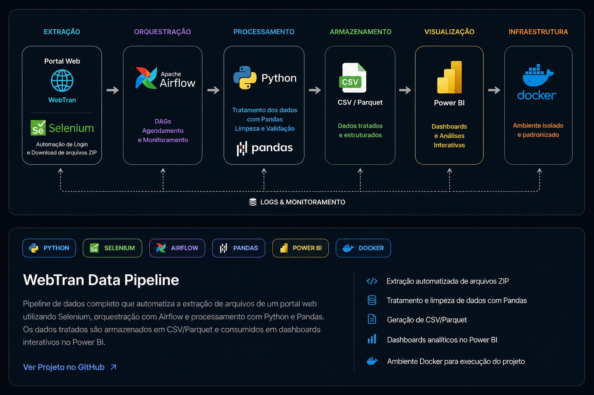
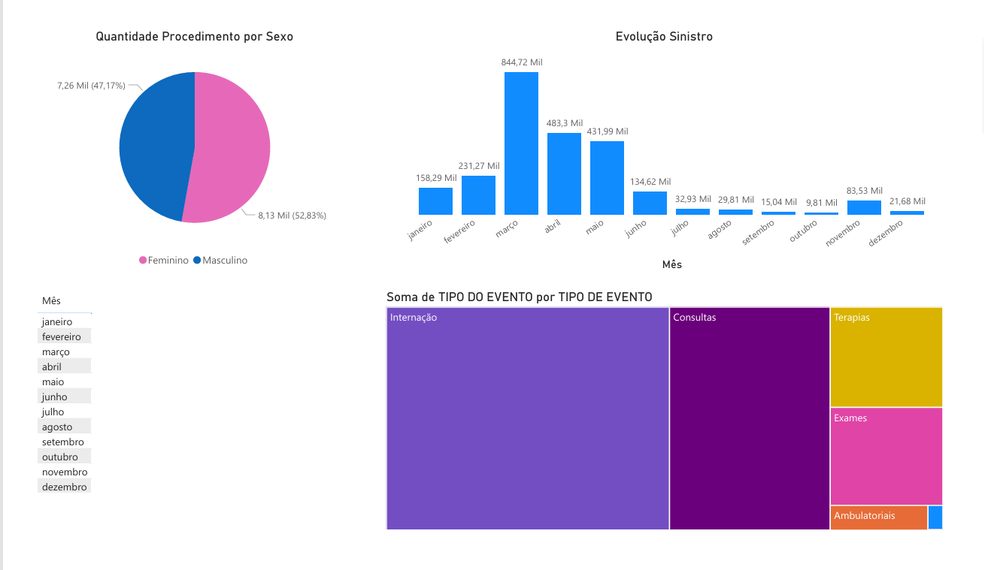

# 🚀 WebTran Data Pipeline (Airflow + Selenium + Pandas + Power BI)

---

## 🇺🇸 About the Project

This project implements a complete Data Engineering pipeline, automating file extraction from a web portal, transforming the data, and making it available for analysis in Power BI.

End-to-end flow:

Extraction → Transformation → Storage → Visualization

---

## 🇧🇷 Sobre o Projeto

Este projeto implementa um pipeline completo de Engenharia de Dados, automatizando a extração de arquivos de um portal web, realizando o tratamento dos dados e disponibilizando para análise no Power BI.

Fluxo completo:

Extração → Transformação → Armazenamento → Visualização

## 🧠 Project Design / Desenho do Projeto

  

---

## 🧱 Architecture / Arquitetura

Web Portal  
↓  
Selenium (Automation)  
↓  
Apache Airflow (Orchestration)  
↓  
Pandas (Data Transformation)  
↓  
CSV / Parquet Files  
↓  
Power BI (Dashboard)

---

## ⚙️ Technologies / Tecnologias

- Python  
- Selenium  
- Apache Airflow (Astro CLI)  
- Pandas  
- Docker  
- Power BI  
- Git/GitHub  

---

## 🔄 Pipeline

### 🇺🇸
- Automated access to the web portal  
- Download of ZIP files  
- Automatic extraction  
- Processing TXT files  
- Data transformation with Pandas  
- Duplicate removal  
- Column standardization  
- Generation of clean datasets  

### 🇧🇷
- Automação de acesso ao portal  
- Download de arquivos ZIP  
- Extração automática  
- Leitura de arquivos TXT  
- Tratamento de dados com Pandas  
- Remoção de duplicados  
- Padronização de colunas  
- Geração de dados tratados  

---

## 🕒 Scheduling / Agendamento

schedule="0 10 * * 1-5"

Runs on weekdays at 10 AM.  
Executa em dias úteis às 10h.

---

## 📊 Dashboard

---

## 📂 Project Structure / Estrutura do Projeto

airflow-bradesco/  
├── dags/  
│   └── roda_script.py  
├── include/  
│   └── scripts/  
│       ├── download.py  
│       └── transform.py  
├── docs/  
│   └── dashboard.png  
├── Dockerfile  
├── requirements.txt  
├── .env.example  
└── README.md  

---

## 🔐 Security / Segurança

### 🇺🇸
Credentials are not stored in the code.

### 🇧🇷
As credenciais não ficam no código.

Environment variables / Variáveis de ambiente:

WEBTRAN_USER  
WEBTRAN_PASS  
WEBTRAN_CODTRAN  

---

## ▶️ How to Run / Como Executar

git clone https://github.com/phsoousa/airflow-brawebtran-data-pipeline.git  
cd airflow-brawebtran-data-pipeline  
astro dev start  

Access Airflow:  
http://localhost:8080  

Run DAG:  
webtran_pipeline  

---

## ✅ Expected Result / Resultado Esperado

WebTran_Downloads/  
└── YYYY-MM-DD/  
    ├── original_file.zip  
    ├── extracted/  
    └── processed/  
        ├── dados_tratados.csv  
        └── dados_tratados.parquet  

---

## 💡 Learnings / Aprendizados

### 🇺🇸
- Workflow orchestration with Airflow  
- Web automation with Selenium  
- Data transformation with Pandas  
- Data preparation for BI  

### 🇧🇷
- Orquestração com Airflow  
- Automação com Selenium  
- Tratamento com Pandas  
- Estruturação de dados para BI  

---

## 👨‍💻 Author / Autor

Pedro Henrique Sousa  
Data Engineer in transition 🚀